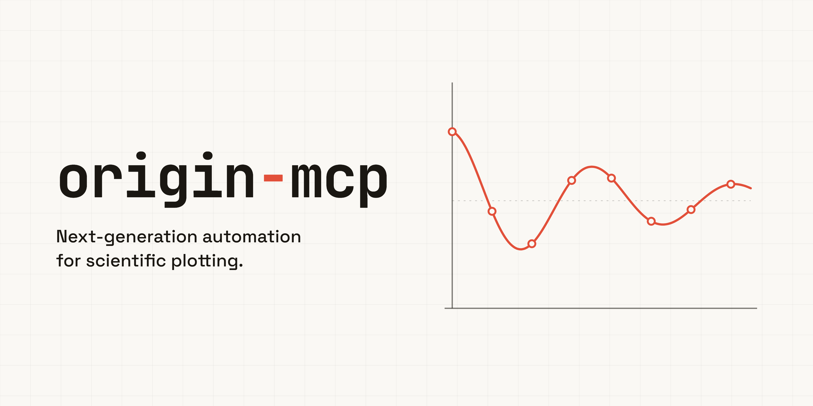

# origin-mcp



[](https://pypi.org/project/origin-mcp/)
[](https://pepy.tech/projects/origin-mcp)
[](https://pypi.org/project/origin-mcp/)
[](LICENSE)

[简体中文](README.zh.md)

`origin-mcp` is a local Model Context Protocol (MCP) server that lets AI
assistants control Origin/OriginPro on Windows. It connects through OriginLab's
Python automation interface and exposes tools for importing data, editing
worksheets, creating and refining graphs, running Origin analyses, exporting
figures, and managing the Origin application lifecycle.

This project is still in a testing stage. Trying it on real Origin workflows,
reporting issues, suggesting improvements, and opening pull requests are all
welcome.

## Highlights

- Import CSV, TSV, TXT, DAT, XLS, and Excel data into Origin worksheets.
- Read, write, sort, clear, and export worksheet data.
- Create and refine common 2D, 3D, contour, statistical, and specialized plots.
- Run Origin analyses such as fitting, smoothing, integration, peak finding,
  descriptive statistics, interpolation, normalization, t-tests, FFT/IFFT, and
  correlation.
- Export figures and projects through a local Origin GUI bridge.
- Save a finished graph as a reusable user template, then search/match and reapply
  it to same-type figures (see [docs/tools.md](docs/tools.md#user-template-library)).

## Nature-Style Figures

By default, origin-mcp keeps the styling defined by the Origin graph template
you are using. If you want a cleaner publication-style scientific figure, ask
your AI assistant to use the Nature-style format when creating or refining the
graph. The preset applies colorblind-aware palettes, stronger scientific plot
strokes, Arial typography, and simpler legends.

For more control, you can ask the assistant to list available palettes. See
[docs/tools.md](docs/tools.md#palette-catalog) for the detailed palette and
style controls.

## Requirements

- Windows
- Origin or OriginPro installed and licensed
- Origin/OriginPro 2026 is the primary tested target; other Origin versions are
  not currently guaranteed
- Origin's embedded Python with the preinstalled `originpro` package

### Python version support

`origin-mcp` runs as two cooperating processes, and the supported Python
versions differ by role:

- **MCP server core** (the `python -m origin_mcp` process, which only talks to
  the bridge over localhost): Python 3.10+. CI tests this core on Windows with
  Python 3.10, 3.11, 3.12, 3.13, and 3.14.
- **Origin bridge** (`addon.py`): runs inside Origin's own embedded Python, so
  its version is whatever your Origin install ships — there is nothing to pick.

Direct external `originpro` automation is not a supported MCP backend for this
project. Start the bridge inside Origin's embedded Python and let the MCP server
connect to it over localhost.

## Installation

Install the MCP server core from PyPI:

```bash
pip install origin-mcp
```

That is all the MCP server needs: it runs as `python -m origin_mcp` and reaches
Origin only through the bridge over localhost. The bridge runs inside Origin's
own embedded Python and installs its own dependencies (see
[Start the Origin Bridge](#start-the-origin-bridge)).

An optional `origin-mcp[origin]` extra pulls `originpro` and `pywin32` into the
same environment; the standard bridge setup does not require it. To work from a
checkout instead, run `pip install -e .` in the repository root.

## Agentic Setup

Copy this to your AI agent and let it self-configure:

```text
Fetch and follow this bootstrap guide end to end:
https://raw.githubusercontent.com/Ge-Shun/origin-mcp/main/docs/agentic/origin-mcp-bootstrap.md
```

## MCP Configuration

Example MCP client configuration:

```json
{
  "mcpServers": {
    "origin": {
      "command": "python",
      "args": ["-m", "origin_mcp"]
    }
  }
}
```

If `python` is not the Python 3.10+ interpreter you installed `origin-mcp`
into, use that interpreter's absolute `python.exe` path instead. More examples
are in [docs/mcp-config.md](docs/mcp-config.md).

## Start the Origin Bridge

The bridge runs inside Origin's own Python so `originpro` stays on Origin's UI
thread. There is nothing to configure — start it once per Origin session:

**Origin Apps (recommended for daily use).** Build and install the two bridge
Apps once with the steps in
[docs/origin-ui-buttons.md](docs/origin-ui-buttons.md). After that, click
**Origin MCP Bridge Start** in the Apps gallery to start the bridge and
**Origin MCP Bridge Stop** to stop it.

**Python Console (one-off or troubleshooting).** Open Origin's **Python Console**
and paste this line (replace the path with your checkout):

```python
import runpy; runpy.run_path(r"C:\path\to\origin-mcp\addon.py", run_name="__main__")
```

A `Bridge is running inside Origin.` box confirms startup; keep that console
running while you use the tools. To stop, ask your MCP assistant to shut the
bridge down (it calls `origin_bridge_shutdown`), or double-click
`scripts\stop-bridge.cmd` (or run `python scripts\stop_bridge.py`). Origin stays
open either way.

If a package is missing or the bridge will not start, see
[docs/origin-bridge.md](docs/origin-bridge.md).

## Security

The bridge listens only on `127.0.0.1` and authenticates local requests by
default with a per-session token, so normal use needs no security setup.

Treat that token as a credential. Any local process that presents it can drive
Origin with the full tool surface, including arbitrary LabTalk execution through
`origin_run_labtalk`. The token is generated per session and written to an
owner-scoped file in your per-user temporary directory
(`%TEMP%/origin-mcp/bridge.json` on Windows), which a standard single-user
machine already protects through the directory's OS permissions. If you redirect
`TEMP` or `ORIGIN_MCP_BRIDGE_HANDSHAKE` to a directory other local users can
read, the token — and therefore control of Origin — is exposed to them. Setting
`ORIGIN_MCP_BRIDGE_NO_AUTH` removes the token boundary entirely and should be
used only when you fully trust every local process.

If you need to restrict which files tools may read or write, set
`ORIGIN_MCP_ALLOWED_ROOTS` to the allowed directories. Avoid disabling bridge
authentication unless you fully trust every local process on the machine.

## License

MIT. See [LICENSE](LICENSE).
